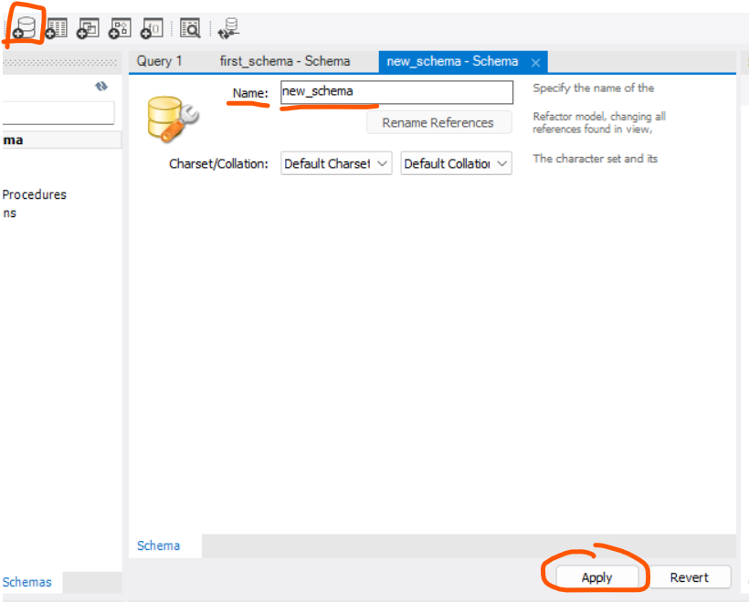

# What was maded in 16/10/2024 class:
## we created a new database at the forth icon at 1.1

## the professor send to us a pre-maded script, and we executed the script.
The script create all that we need to the rest os class.
## Then we used " select * " that take(select) everything(*), " from alunos; " from(from) the table alunos(alunos)
The professor said that it isn't good to use *, is a bad habit.


# Observacions
## to use " as " use use
```bash
SELECT numero_mat MATRICULA,
nome, NOME
 ```
It's basically like import numero_mat as MATRICULA, but in MYSQL is in that way, but can still use as.

# example from prof using condition with "where"
```bash
select a.numero_mat as “Matricula”,
a.nome as “Nome”,
a.cod_curso as “Curso”
from alunos a
where cod_curso in ( 3, 5 );
```
this example shows that is possible to use "as", but is not obrigatory, and put a condition using "where cod_curso in (3, 5)" that will only take data that are in this condition.

# Get courses from students who have ‘Oliveira’ or ‘Santos’ in your last name.
```bash
select distinct cod_curso
 from alunos
 where upper (nome) like '%OLIVEIRA%' or
    upper (nome) like '%SANTOS%';
```
the "like" will verify that %...% is in "nome" and the " % " will verify if is in it.