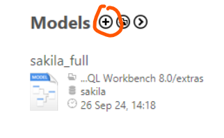
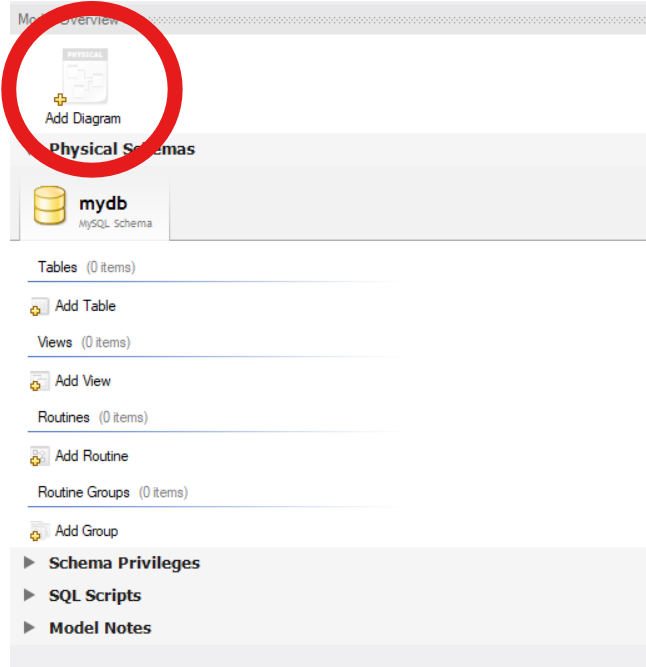
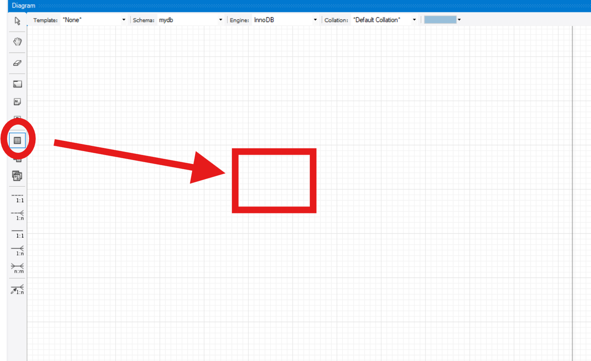

# UNIT_Database_exercices
# Tutorial for creating a model!
## First initialize the MYSQL Workbench. Example 1.1

## Then click on plus, rounded by a red circle. Example 1.2

## To create a diagram, click on add diagram. Example 1.3

## To create a table, click on the icon at Example 1.4 and click on workspace

